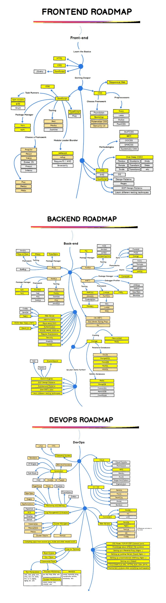

# Complete Web Development

## Frontend Web Development

1. HTML, CSS , JavaScript
2. CSS Frameworks: 
    i. Bootstrap
    ii. Preprocessors: SASS , LESS etc  read about them and explore if something useful.
    iii. Materialize CSS
3. JavaScript in depth

## Backend Development

# Web-dev-must-visit-websites
Must visit websites for some awesome hacks 

  1. For some random tricks on CSS : https://css-tricks.com/
  2. An amazing resource for high quality textured patterns : https://www.toptal.com/designers/subtlepatterns/
  3. Free Pictures and Images:  https://www.freepik.com/
  4. Github Repo consisting of large number of Photos :  https://github.com/heyalexej/awesome-images
  5. Google Fonts :  https://fonts.google.com/
  6. Graphic Freebies :  https://www.bypeople.com/
  7. https://tutorialzine.com/2014/09/50-awesome-tools-and-resources-for-web-developers 50 best resources
  
  
  Important Contents for web
  1. https://www.synesthesia.world/en/molly
  2. https://codemyui.com/login-signup-switch-card-ui/   Login Page and SignUp
  3. http://www.justinaguilar.com/animations/#   CSS3 Animation Cheat Sheet
  4. 
